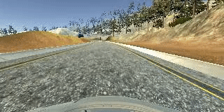

# Project Description - BehavioralCloning
This is the code for third project (Behavioral Cloning)

This project makes use of a Udacity-developed driving simulator and training data collected from the simulator. The training data need to be developed by running the car in the simulator in training mode. The training data is generated by  images captured from the different camera  in the simulator car (i.e camera mounted in the the centre, the left and the right of the car). There are few other paramters that gets generates (steering, throttle, brake, speed), but they are not used for this project.
Three images as input and the steering angle as output will be generated per frame and a sample data set is show below

- Centre- center_2018_07_31_22_27_43_693.jpg
- Left- left_2018_07_31_22_27_43_693.jpg
- Right- right_2018_07_31_22_27_43_693.jpg
- Steering angle- -0.5494633

Once the **training data** is generated for one lap of driving for the chosen test track, a deep neural network is used to clone car driving behaviour. It is a **supervised regression** problem between the the road images in front of a car and its steering angles and.
The network is based on The [NVIDIA model](https://devblogs.nvidia.com/deep-learning-self-driving-cars/), which has been proven to work very well in this problem domain.
As image processing is involved, the model is using convolutional layers for automated feature engineering.

#This was used for setting the environment

### Use TensorFlow without GPU
conda env create -f environment.yml 

### Use TensorFlow with GPU *This was used when the code was run in AWS EC2 instance) # 
Note- I needed to install cuDNN compatible libraries and header files as the [NVDIA setup instructions](https://developer.nvidia.com/rdp/cudnn-archive )as well on the top of above
conda env create -f environment-gpu.yml

## To train the model
The following python scrip was run in the working folder to train the model

python model.py

This will generate a file model-000.h5. Whenever the performance in the epoch is better than the previous best. For example, the first epoch will generate a file called model-001.h5. One the training is complete, rename the file to model.h5

## To Test the model
Once the training is complete , we need to check the performance of the model by first 
starting up the Udacity self-driving simulator, then choose a track and press the Autonomous Mode button. 

Then, run the model by running the following script:
python drive.py model.h5

## To record the images from frames when the car is running in autonomous mode

python drive.py model.h5 run1

## To create a video from the above images

The image file name from above has a timestamp of when the images were seen.. This information is used by video.py to create a chronological video of the agent driving by the following script

python video.py run1

# Approach
## 1. Model Selection and Data preprocessing

As suggested by Udacity, in this project the [NVIDIA model](https://devblogs.nvidia.com/deep-learning-self-driving-cars/) was used,  

The **NVIDIA model** is well documented and hence very useful for the project

The following adjustments were done to training the model with the training data
- To avoid saturation and make gradients work better, one Lambda layer was used to normalized input images 
- An additional dropout layer to avoid overfitting after the convolution layers.
- The ELU activation function was used for every layer except for the output layer to introduce non-linearity.

The NVDIA model does not provide the activation function, hence ELU activiation function was selected. Finally the model selected is as follows
- Image normalization using a Keras Lambda function
- Convolution: 5x5, filter: 24, strides: 2x2, activation: ELU
- Convolution: 5x5, filter: 36, strides: 2x2, activation: ELU
- Convolution: 5x5, filter: 48, strides: 2x2, activation: ELU
- Convolution: 3x3, filter: 64, strides: 1x1, activation: ELU
- Convolution: 3x3, filter: 64, strides: 1x1, activation: ELU
- Drop out (0.5)
- Fully connected: neurons: 100, activation: ELU
- Fully connected: neurons: 50, activation: ELU
- Fully connected: neurons: 10, activation: ELU
- Fully connected: neurons: 1 (output)

# Data Preprocessing
## Image Sizing

* the images are cropped so that the model won’t be trained with the sky and the car front parts
* the images are resized to 66x200 (3 YUV channels) as per NVIDIA model
* the images are normalized (image data divided by 127.5 and subtracted 1.0). As stated in the Model Architecture section, this is to avoid saturation and make gradients work better)

# Model Training
## Image Augumentation
The following augumentation technique along with Python generator to generate unlimited number of images:

-  Randomly choose an image from the center, left or right, and adjust the steering angle.
- For left/right image, steering angle is adjusted by +0.2/-0.2
- Randomly flip image left/right
- Randomly shift the image vertically and horizontally
- Randomly added shadows
- Randomly adjust Saturation in HLS

# Training, Validation and Test

Then the images were splitted into train and validation set in order to measure the performance at every epoch. Testing was done using the simulator.

As for training,

 Mean squared error method was used for the loss function to measure how close the model predicts to the given steering angle for each image.
 Adam optimizer was used for optimization with learning rate of 1.0e-4 
 
 ModelCheckpoint from Keras was used to save the model only if the validation loss is improved when compared with previous epoch.

# Final Model

Once the model  performed optimally on one of the track, the model was frozen. 
Here is the output of the model when the simulator was run in autonomous mode and the following code were run
- python drive.py model.h5 run1 --> which steers the simulator car to stay in the middle of the road and saves the images from the frames in chronological order in folder "run1" followed by 
- python video.py run1, which saves the images in run1 folder in run1.mp4 . 
- The gif format of run1.mp4 is embedded below

| Autonomous  Driving  | 
|:--------------------:| 
| | 

